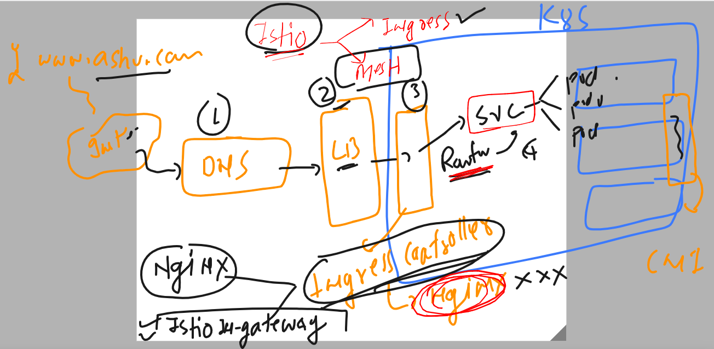

### good bye to monolit with no of problems we had 


### introduction to microservices


## problems with container based deployment using microservices models 

### how we deploy 3 tier micro services in k8s api resources 


### Istio will be injecting an init-container as sidecar pattern in our k8s app deployment pod 


## Architecture and working of Istio -- 


### Istio setup in k8s cluster 


### to setup istio using any given method -- we need to have k8s client machine configured 

```
[ashu@ip-172-31-32-172 ~]$ kubectl  version --client  -o yaml 
clientVersion:
  buildDate: "2023-03-15T13:39:54Z"
  compiler: gc
  gitCommit: 0ce7342c984110dfc93657d64df5dc3b2c0d1fe9
  gitTreeState: clean
  gitVersion: v1.25.8
  goVersion: go1.19.7
  major: "1"
  minor: "25"
  platform: linux/amd64
kustomizeVersion: v4.5.7

[ashu@ip-172-31-32-172 ~]$ 
[ashu@ip-172-31-32-172 ~]$ kubectl  get  nodes
The connection to the server localhost:8080 was refused - did you specify the right host or port?
[ashu@ip-172-31-32-172 ~]$ 

```

### From k8s client machine -- installing istio in k8s cluster -- using istioCTL 

### Download istio package 

```
[root@ip-172-31-32-172 opt]# curl -L https://istio.io/downloadIstio | ISTIO_VERSION=1.17.1 TARGET_ARCH=x86_64 sh -
  % Total    % Received % Xferd  Average Speed   Time    Time     Time  Current
                                 Dload  Upload   Total   Spent    Left  Speed
100   102  100   102    0     0    344      0 --:--:-- --:--:-- --:--:--   345
100  4856  100  4856    0     0   8651      0 --:--:-- --:--:-- --:--:--  8651

Downloading istio-1.17.1 from https://github.com/istio/istio/releases/download/1.17.1/istio-1.17.1-linux-amd64.tar.gz ...

Istio 1.17.1 Download Complete!

Istio has been successfully downloaded into the istio-1.17.1 folder on your system.

Next Steps:
See https://istio.io/latest/docs/setup/install/ to add Istio to your Kubernetes cluster.

To configure the istioctl client tool for your workstation,
add the /opt/istio-1.17.1/bin directory to your environment path variable with:
	 export PATH="$PATH:/opt/istio-1.17.1/bin"

Begin the Istio pre-installation check by running:
	 istioctl x precheck 

Need more information? Visit https://istio.io/latest/docs/setup/install/ 
[root@ip-172-31-32-172 opt]# ls
aws  istio-1.17.1

```

### setting linux path variable to get istioctl 

```
[root@ip-172-31-32-172 opt]# ls
aws  istio-1.17.1
[root@ip-172-31-32-172 opt]# 
[root@ip-172-31-32-172 opt]# cd istio-1.17.1/
[root@ip-172-31-32-172 istio-1.17.1]# ls
LICENSE  README.md  bin  manifest.yaml  manifests  samples  tools
[root@ip-172-31-32-172 istio-1.17.1]# pwd
/opt/istio-1.17.1
[root@ip-172-31-32-172 istio-1.17.1]# vim ~/.bashrc 

===

ISTIO_HOME=/opt/istio-1.17.1
PATH=$PATH:$ISTIO_HOME/bin
export PATH
===

[root@ip-172-31-32-172 istio-1.17.1]# source ~/.bashrc 
[root@ip-172-31-32-172 istio-1.17.1]# 
[root@ip-172-31-32-172 istio-1.17.1]# istioctl  version 
no running Istio pods in "istio-system"
1.17.1

```

### Install 

```
[root@ip-172-31-32-172 ~]# istioctl  install 
This will install the Istio 1.17.1 default profile with ["Istio core" "Istiod" "Ingress gateways"] components into the cluster. Proceed? (y/N) y
✔ Istio core installed                                                                                                                    
✔ Istiod installed                                                                                                                        
✔ Ingress gateways installed                                                                                                              
✔ Installation complete                                                                                                                   Making this installation the default for injection and validation.

Thank you for installing Istio 1.17.  Please take a few minutes to tell us about your install/upgrade experience!  https://forms.gle/hMHGiwZHPU7UQRWe9

```

### verify it 

```
[ashu@ip-172-31-32-172 ~]$ kubectl   get  ns
NAME              STATUS   AGE
default           Active   3h54m
istio-system      Active   4m12s
kube-node-lease   Active   3h54m
kube-public       Active   3h54m
kube-system       Active   3h54m

```

### more things 

```
[ashu@ip-172-31-32-172 ~]$ kubectl  get  po -n istio-system 
NAME                                    READY   STATUS    RESTARTS   AGE
istio-ingressgateway-647966f79b-2dfjr   1/1     Running   0          5m1s
istiod-b7665cfd8-zsjjl                  1/1     Running   0          5m11s
[ashu@ip-172-31-32-172 ~]$ kubectl  get  deploy -n istio-system 
NAME                   READY   UP-TO-DATE   AVAILABLE   AGE
istio-ingressgateway   1/1     1            1           6m10s
istiod                 1/1     1            1           6m20s
[ashu@ip-172-31-32-172 ~]$ 


```

### 

```
[ashu@ip-172-31-32-172 ~]$ istioctl  version 
client version: 1.17.1
control plane version: 1.17.1
data plane version: 1.17.1 (1 proxies)
[ashu@ip-172-31-32-172 ~]$ 

```

### finally verification of istioctl 

```
[ashu@ip-172-31-32-172 ~]$ istioctl   verify-install
1 Istio control planes detected, checking --revision "default" only
✔ HorizontalPodAutoscaler: istio-ingressgateway.istio-system checked successfully
✔ Deployment: istio-ingressgateway.istio-system checked successfully
✔ PodDisruptionBudget: istio-ingressgateway.istio-system checked successfully
✔ Role: istio-ingressgateway-sds.istio-system checked successfully
✔ RoleBinding: istio-ingressgateway-sds.istio-system checked successfully
✔ Service: istio-ingressgateway.istio-system checked successfully
✔ ServiceAccount: istio-ingressgateway-service-account.istio-system checked successfully
✔ ClusterRole: istiod-istio-system.istio-system checked successfully
✔ ClusterRole: istio-reader-istio-system.istio-system checked successfully
✔ ClusterRoleBinding: istio-reader-istio-system.istio-system checked 
```

### Understanding istio ingress controller -- istio ingressgateway 



### verify it 

```
[ashu@ip-172-31-32-172 ~]$ kubectl  get ns
NAME              STATUS   AGE
default           Active   4h23m
istio-system      Active   32m
kube-node-lease   Active   4h23m
kube-public       Active   4h23m
kube-system       Active   4h23m
[ashu@ip-172-31-32-172 ~]$ 
[ashu@ip-172-31-32-172 ~]$ 
[ashu@ip-172-31-32-172 ~]$ kubectl  get  deploy -n  istio-system
NAME                   READY   UP-TO-DATE   AVAILABLE   AGE
istio-ingressgateway   1/1     1            1           32m
istiod                 1/1     1            1           33m
[ashu@ip-172-31-32-172 ~]$ 
[ashu@ip-172-31-32-172 ~]$ kubectl  get  po  -n  istio-system
NAME                                    READY   STATUS    RESTARTS   AGE
istio-ingressgateway-647966f79b-2dfjr   1/1     Running   0          33m
istiod-b7665cfd8-zsjjl                  1/1     Running   0          33m
[ashu@ip-172-31-32-172 ~]$ 
[ashu@ip-172-31-32-172 ~]$ kubectl  get  svc  -n  istio-system
NAME                   TYPE           CLUSTER-IP       EXTERNAL-IP                                                                PORT(S)                                      AGE
istio-ingressgateway   LoadBalancer   10.100.142.23    ac80ade540ae9431087187d82e4ee4ec-1788128451.ap-south-1.elb.amazonaws.com   15021:31336/TCP,80:31766/TCP,443:30756/TCP   33m
istiod                 ClusterIP      10.100.194.141   <none>                                                                     15010/TCP,15012/TCP,443/TCP,15014/TCP        33m
[ashu@ip-172-31-32-172 ~]$ 


```


