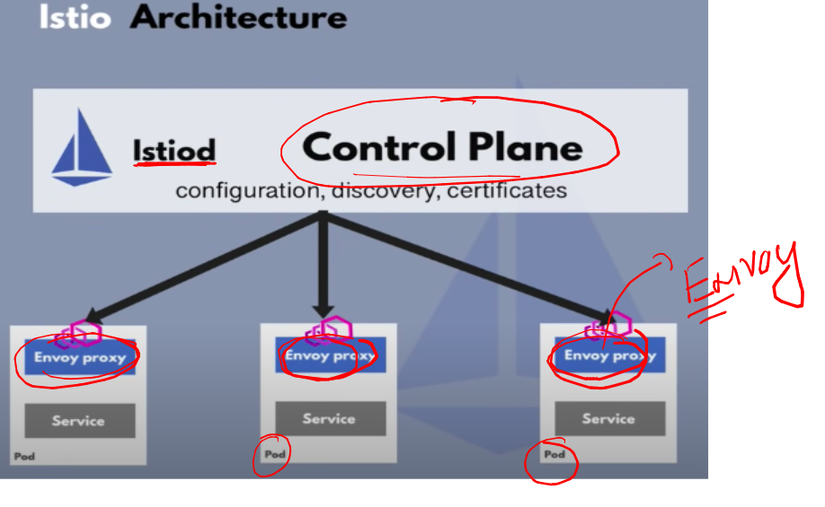
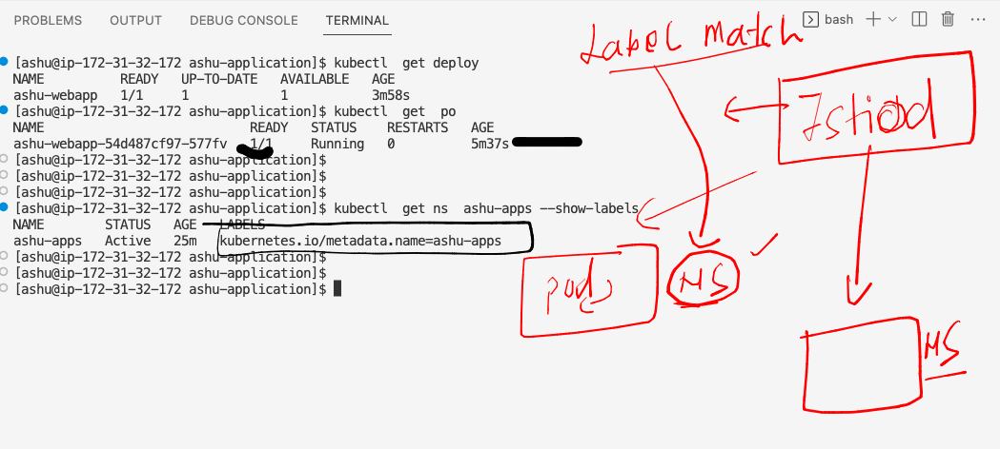
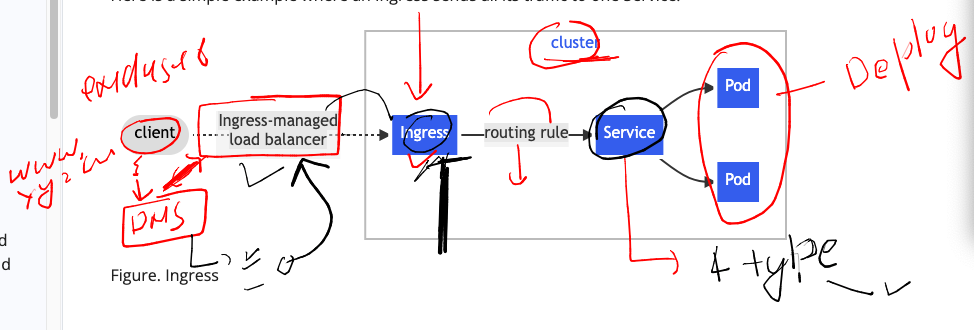
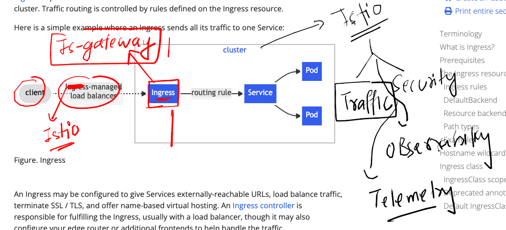
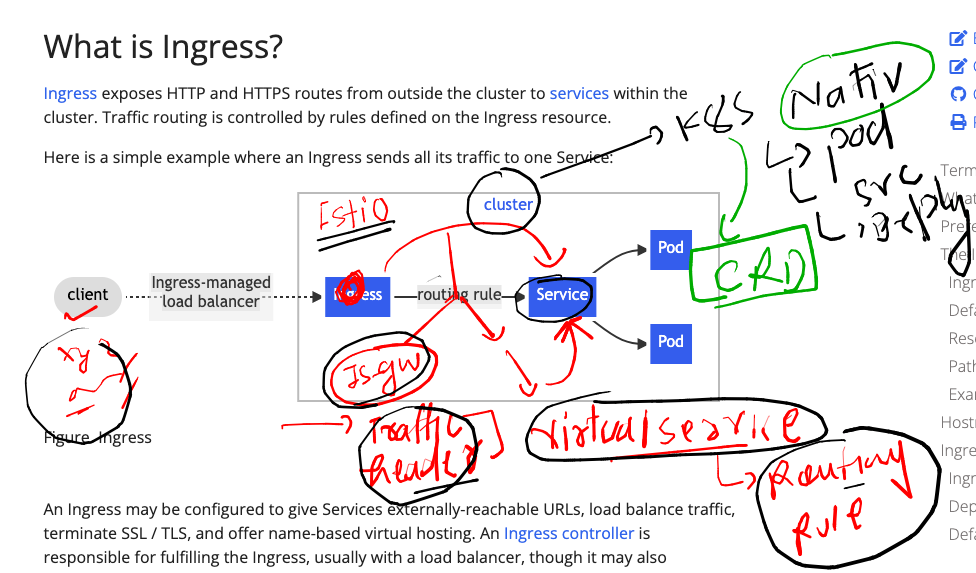

### lab connection 


### checking istioctl and kubectl working status 

```

[ashu@ip-172-31-32-172 ~]$ kubectl  get nodes
NAME                                            STATUS   ROLES    AGE   VERSION
ip-192-168-17-96.ap-south-1.compute.internal    Ready    <none>   76m   v1.25.6-eks-48e63af
ip-192-168-39-228.ap-south-1.compute.internal   Ready    <none>   76m   v1.25.6-eks-48e63af
ip-192-168-87-0.ap-south-1.compute.internal     Ready    <none>   76m   v1.25.6-eks-48e63af
[ashu@ip-172-31-32-172 ~]$ 
[ashu@ip-172-31-32-172 ~]$ istioctl version 
client version: 1.17.1
control plane version: 1.17.1
data plane version: 1.17.1 (1 proxies)
```

### More info about envoy 



### URL to read more about this 

[click_here](https://www.envoyproxy.io/)

## Lets create k8s namespace to deploy our sample app 

```
[ashu@ip-172-31-32-172 ~]$ kubectl  get  ns
NAME              STATUS   AGE
default           Active   102m
istio-system      Active   88m
kube-node-lease   Active   102m
kube-public       Active   102m
kube-system       Active   102m
[ashu@ip-172-31-32-172 ~]$ 
[ashu@ip-172-31-32-172 ~]$ kubectl  create  namespace  ashu-apps 
namespace/ashu-apps created
[ashu@ip-172-31-32-172 ~]$ kubectl  get  ns
NAME              STATUS   AGE
ashu-apps         Active   2s
default           Active   103m
istio-system      Active   89m
kube-node-lease   Active   103m
kube-public       Active   103m
kube-system       Active   103m
[ashu@ip-172-31-32-172 ~]$ kubectl   config set-context --current --namespace=ashu-apps
Context "iam-root-account@basic-cluster.ap-south-1.eksctl.io" modified.
[ashu@ip-172-31-32-172 ~]$ 
[ashu@ip-172-31-32-172 ~]$ kubectl   config get-contexts 
CURRENT   NAME                                                  CLUSTER                              AUTHINFO                                              NAMESPACE
*         iam-root-account@basic-cluster.ap-south-1.eksctl.io   basic-cluster.ap-south-1.eksctl.io   iam-root-account@basic-cluster.ap-south-1.eksctl.io   ashu-apps
[ashu@ip-172-31-32-172 ~]$ kubectl  get pod
No resources found in ashu-apps namespace.
[ashu@ip-172-31-32-172 ~]$ kubectl  get svc
No resources found in ashu-apps namespace.
```

## Testing Istio envoy 

### creating a sample deployment in my namespace

```
kubectl  create  deployment  ashu-webapp --image=nginx --port 80 --replicas=1 --dry-run=client -o yaml  >ashu-deploy.yaml 
===
[ashu@ip-172-31-32-172 ashu-application]$ ls
ashu-deploy.yaml
[ashu@ip-172-31-32-172 ashu-application]$ kubectl  apply -f ashu-deploy.yaml 
deployment.apps/ashu-webapp created
[ashu@ip-172-31-32-172 ashu-application]$ kubectl   get  deploy 
NAME          READY   UP-TO-DATE   AVAILABLE   AGE
ashu-webapp   0/1     1            0           5s
[ashu@ip-172-31-32-172 ashu-application]$ kubectl   get  deploy 
NAME          READY   UP-TO-DATE   AVAILABLE   AGE
ashu-webapp   1/1     1            1           13s
[ashu@ip-172-31-32-172 ashu-application]$ kubectl  get  rs
NAME                     DESIRED   CURRENT   READY   AGE
ashu-webapp-54d487cf97   1         1         1       18s
[ashu@ip-172-31-32-172 ashu-application]$ kubectl  get  po
NAME                           READY   STATUS    RESTARTS   AGE
ashu-webapp-54d487cf97-577fv   1/1     Running   0          21s
[ashu@ip-172-31-32-172 ashu-application]$ 


```

## istio will not be injecting any envoy proxy by default 

### label our target namespaces where we want istio to enject envoy proxy 



### assinging label 

```
[ashu@ip-172-31-32-172 ashu-application]$ kubectl  label namespaces ashu-apps  istio-injection=enabled 
[ashu@ip-172-31-32-172 ashu-application]$ kubectl  get ns  ashu-apps --show-labels
NAME        STATUS   AGE   LABELS
ashu-apps   Active   30m   istio-injection=enabled,kubernetes.io/metadata.name=ashu-apps
[ashu@ip-172-31-32-172 ashu-application]$ 
```

### redeploy it again 

```
[ashu@ip-172-31-32-172 ashu-application]$ kubectl  delete  -f ashu-deploy.yaml 
deployment.apps "ashu-webapp" deleted
[ashu@ip-172-31-32-172 ashu-application]$ 
[ashu@ip-172-31-32-172 ashu-application]$ kubectl  apply   -f ashu-deploy.yaml 
deployment.apps/ashu-webapp created
[ashu@ip-172-31-32-172 ashu-application]$ kubectl  get deploy 
NAME          READY   UP-TO-DATE   AVAILABLE   AGE
ashu-webapp   1/1     1            1           8s
[ashu@ip-172-31-32-172 ashu-application]$ kubectl   get po
NAME                           READY   STATUS    RESTARTS   AGE
ashu-webapp-54d487cf97-bgjd5   2/2     Running   0          13s
[ashu@ip-172-31-32-172 ashu-application]$ 


```

### scaling will also be having injection 

```
[ashu@ip-172-31-32-172 ashu-application]$ kubectl  scale deploy ashu-webapp  --replicas 3
deployment.apps/ashu-webapp scaled
[ashu@ip-172-31-32-172 ashu-application]$ kubectl  get po
NAME                           READY   STATUS            RESTARTS   AGE
ashu-webapp-54d487cf97-bgjd5   2/2     Running           0          13m
ashu-webapp-54d487cf97-brhpv   0/2     PodInitializing   0          2s
ashu-webapp-54d487cf97-lr4tm   0/2     PodInitializing   0          2s
[ashu@ip-172-31-32-172 ashu-application]$ kubectl  get po
NAME                           READY   STATUS    RESTARTS   AGE
ashu-webapp-54d487cf97-bgjd5   2/2     Running   0          13m
ashu-webapp-54d487cf97-brhpv   2/2     Running   0          10s
ashu-webapp-54d487cf97-lr4tm   2/2     Running   0          10s
[ashu@ip-172-31-32-172 ashu-application]$ kubectl  scale deploy ashu-webapp  --replicas 1
deployment.apps/ashu-webapp scaled
[ashu@ip-172-31-32-172 ashu-application]$ kubectl  get po
NAME                           READY   STATUS        RESTARTS   AGE
ashu-webapp-54d487cf97-bgjd5   2/2     Running       0          14m
ashu-webapp-54d487cf97-brhpv   2/2     Terminating   0          68s
ashu-webapp-54d487cf97-lr4tm   2/2     Terminating   
```

## Understanding Ingress 




### creating clusterip type service in k8s deployment 

```
[ashu@ip-172-31-32-172 ashu-application]$ kubectl  get deploy 
NAME          READY   UP-TO-DATE   AVAILABLE   AGE
ashu-webapp   1/1     1            1           34m
[ashu@ip-172-31-32-172 ashu-application]$ kubectl  expose  deployment  ashu-webapp  --type ClusterIP --port 80 --name ashu-svc1 --dry-run=client -o yaml  >ui_svc.yaml 
[ashu@ip-172-31-32-172 ashu-application]$ kubectl  apply -f ui_svc.yaml 
service/ashu-svc1 created
[ashu@ip-172-31-32-172 ashu-application]$ kubectl  get  svc
NAME        TYPE        CLUSTER-IP      EXTERNAL-IP   PORT(S)   AGE
ashu-svc1   ClusterIP   10.100.58.212   <none>        80/TCP    3s
[ashu@ip-172-31-32-172 ashu-application]$ 
[ashu@ip-172-31-32-172 ashu-application]$ kubectl   get  ep 
NAME        ENDPOINTS         AGE
ashu-svc1   192.168.4.66:80   15s
[ashu@ip-172-31-32-172 ashu-application]$ kubectl  get  po -o wide
NAME                           READY   STATUS    RESTARTS   AGE   IP             NODE                                           NOMINATED NODE   READINESS GATES
ashu-webapp-54d487cf97-bgjd5   2/2     Running   0          35m   192.168.4.66   ip-192-168-17-96.ap-south-1.compute.internal   <none>           <none>
[ashu@ip-172-31-32-172 ashu-application]$ 
```

## using Istio-ingressgateway instead of nginx ingress controller 



### checking istio-gw

```
[ashu@ip-172-31-32-172 ashu-application]$ kubectl  get deploy -n istio-system 
NAME                   READY   UP-TO-DATE   AVAILABLE   AGE
istio-ingressgateway   1/1     1            1           3h14m
istiod                 1/1     1            1           3h14m
[ashu@ip-172-31-32-172 ashu-application]$ 
[ashu@ip-172-31-32-172 ashu-application]$ kubectl  get svc  -n istio-system 
'NAME                   TYPE           CLUSTER-IP      EXTERNAL-IP                                                               PORT(S)                                      AGE
istio-ingressgateway   LoadBalancer   10.100.45.173   a953a6892252643f0863bc71c347ffba-784553568.ap-south-1.elb.amazonaws.com   15021:31678/TCP,80:31579/TCP,443:31970/TCP   3h19m
istiod                 ClusterIP      10.100.237.34   <none>                                                                    15010/TCP,15012/TCP,443/TCP,15014/TCP        3h19m
[ashu@ip-172-31-32-172 ashu-application]$ '

```

### to Implement application access from outside -- via Istio we have to create two new CRD's 

<ol>
  <li> Istio gateway resources </li>
  <li> Virtual services resource </li>
</ol>




### creating custom istio-gateway resource  to filter a particular webapp url / uri

### 

```
apiVersion: networking.istio.io/v1beta1
kind: Gateway
metadata:
  name: ashu-gateway # name of istio gateway 
  namespace: ashu-apps # namespace where i want to deploy istio gateway 
spec:
  selector:  # to find the ingress controller out of any like nginx , istio , kong , haproxy 
    istio: ingressgateway # label of istio-ingressgateway which is running in istio-system  
  servers:
  - port: # to filter a particular protocol or ports
      number: 80
      name: http 
      protocol: HTTP
    hosts: # the application URL for which i am searching header 
    - me.ashutoshh.in 
```

### lets deploy it 

```
[ashu@ip-172-31-32-172 ashu-application]$ kubectl  apply -f  ashu_istio_gateway.yaml  
gateway.networking.istio.io/ashu-gateway created
[ashu@ip-172-31-32-172 ashu-application]$ kubectl  get  gateway
NAME           AGE
ashu-gateway   8s
[ashu@ip-172-31-32-172 ashu-application]$ kubectl  get  gw
NAME           AGE
ashu-gateway   12s
```


