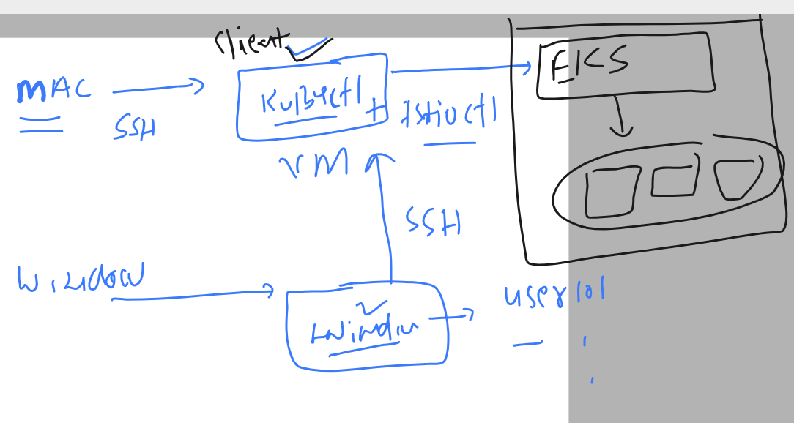

### lab connection 



### checking istioctl and kubectl working status 

```

[ashu@ip-172-31-32-172 ~]$ kubectl  get nodes
NAME                                            STATUS   ROLES    AGE   VERSION
ip-192-168-17-96.ap-south-1.compute.internal    Ready    <none>   76m   v1.25.6-eks-48e63af
ip-192-168-39-228.ap-south-1.compute.internal   Ready    <none>   76m   v1.25.6-eks-48e63af
ip-192-168-87-0.ap-south-1.compute.internal     Ready    <none>   76m   v1.25.6-eks-48e63af
[ashu@ip-172-31-32-172 ~]$ 
[ashu@ip-172-31-32-172 ~]$ istioctl version 
client version: 1.17.1
control plane version: 1.17.1
data plane version: 1.17.1 (1 proxies)
```


