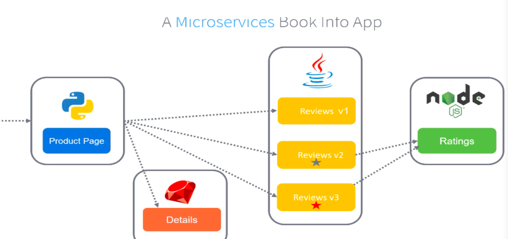
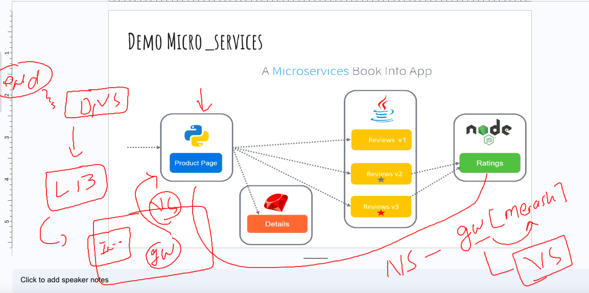
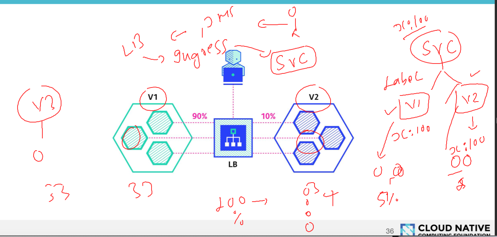
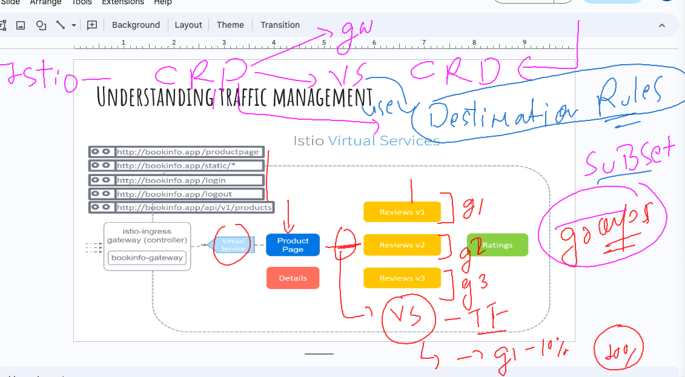

## Istio Revision 

## creating namespace and setting it as default 

```
[ashu@ip-172-31-32-172 ashu-application]$ kubectl  create  namespace  ashu-webapp
namespace/ashu-webapp created
[ashu@ip-172-31-32-172 ashu-application]$ kubectl  get ns
kNAME              STATUS   AGE
ashu-webapp       Active   3s
default           Active   3h33m
istio-system      Active   3h17m
kube-node-lease   Active   3h33m
kube-public       Active   3h33m
kube-system       Active   3h33m
[ashu@ip-172-31-32-172 ashu-application]$ kubectl  config set-context --current --namespace ashu-webapp
Context "iam-root-account@basic-cluster.ap-south-1.eksctl.io" modified.
[ashu@ip-172-31-32-172 ashu-application]$ 
[ashu@ip-172-31-32-172 ashu-application]$ kubectl  get  po
No resources found in ashu-webapp namespace.
[ashu@ip-172-31-32-172 ashu-application]$ kubectl  get  svc
No resources found in ashu-webapp namespace.
[ashu@ip-172-31-32-172 ashu-application]$ kubectl  get  vs
No resources found in ashu-webapp namespace.
```

### taking sample micro service webapp with UI / backend / db 



### deploy book info micro service to your personal namespace 

```
[ashu@ip-172-31-32-172 ashu-application]$ kubectl  apply -f micro-service/bookinfo.yaml 
service/details created
serviceaccount/bookinfo-details created
deployment.apps/details-v1 created
service/ratings created
serviceaccount/bookinfo-ratings created
deployment.apps/ratings-v1 created
service/reviews created
serviceaccount/bookinfo-reviews created
deployment.apps/reviews-v1 created
deployment.apps/reviews-v2 created
deployment.apps/reviews-v3 created
service/productpage created
serviceaccount/bookinfo-productpage created
deployment.apps/productpage-v1 created
```

### Verify and redeploy it 

```
[ashu@ip-172-31-32-172 ashu-application]$ kubectl  label namespaces ashu-webapp  istio-injection=enabled
namespace/ashu-webapp labeled
[ashu@ip-172-31-32-172 ashu-application]$ kubectl  get ns ashu-webapp --show-labels 
NAME          STATUS   AGE   LABELS
ashu-webapp   Active   16m   istio-injection=enabled,kubernetes.io/metadata.name=ashu-webapp
[ashu@ip-172-31-32-172 ashu-application]$ kubectl  apply -f micro-service/bookinfo.yaml 
service/details created
serviceaccount/bookinfo-details created
deployment.apps/details-v1 created
service/ratings created
serviceaccount/bookinfo-ratings created
deployment.apps/ratings-v1 created
service/reviews created
serviceaccount/bookinfo-reviews created
deployment.apps/reviews-v1 created
deployment.apps/reviews-v2 created
deployment.apps/reviews-v3 created
service/productpage created
serviceaccount/bookinfo-productpage created
deployment.apps/productpage-v1 created
[ashu@ip-172-31-32-172 ashu-application]$ kubectl  get po
NAME                             READY   STATUS            RESTARTS   AGE
details-v1-5ffd6b64f7-6qdbh      2/2     Running           0          8s
productpage-v1-979d4d9fc-dkvh9   0/2     PodInitializing   0          7s
ratings-v1-5f9699cfdf-kzlvn      2/2     Running           0          8s
reviews-v1-569db879f5-jzt4s      2/2     Running           0          8s
reviews-v2-65c4dc6fdc-8dn22      2/2     Running           0          7s
reviews-v3-c9c4fb987-gd74h       2/2     Running           0          7s
[ashu@ip-172-31-32-172 ashu-application]$ 
```

### Expose webapp outside k8s cluster 

### creating istio-gateway CRD 

```
apiVersion: networking.istio.io/v1beta1
kind: Gateway
metadata:
  name: ashu-micro-app-gw # name of my istio gateway to handle network filter
  namespace: ashu-webapp 
spec:
  selector: # for selecting the ingress controller out of nginx , istio , kong , ha proxy 
    istio: ingressgateway 
  servers:
  - port:
      number: 80
      name: http
      protocol: HTTP
    hosts:
    - me.ashutoshh.in
```

### lets deploy it 

```
[ashu@ip-172-31-32-172 ashu-application]$ ls
ashu-deploy.yaml  ashu_istio_gateway.yaml  ashu_virtual_svc.yaml  micro-service  ui_svc.yaml
[ashu@ip-172-31-32-172 ashu-application]$ kubectl  apply -f micro-service/ashu-istiogateway.yaml 
gateway.networking.istio.io/ashu-micro-app-gw created
[ashu@ip-172-31-32-172 ashu-application]$ kubectl  get  gw 
NAME                AGE
ashu-micro-app-gw   3s
```

### Understanding traffic routing by virtual service -- redirect to home page micro service




### creating virtual service only for product micro service component 

```
apiVersion: networking.istio.io/v1beta1
kind: VirtualService
metadata:
  name: ashu-vs-routing-rule # name of routing rule
  namespace: ashu-webapp  # namespace info 
spec:
  gateways: # name of gateway 
  - ashu-micro-app-gw
  hosts:
  - me.ashutoshh.in
  http:
  - match: # figure out redirection urls /login
    - uri:
        exact: /productpage
    - uri:
        prefix: /static
    - uri:
        exact: /login
    - uri:
        exact: /logout
    - uri: 
        prefix: /api/v1/products
    route:  # redirect to below service 
    - destination:
        host: productpage # service name of frontpage micro service 
        port:
          number: 9080
```

### depoy it 

```
[ashu@ip-172-31-32-172 ashu-application]$ kubectl  apply -f micro-service/ashu-home-vs.yaml 
virtualservice.networking.istio.io/ashu-vs-routing-rule created
[ashu@ip-172-31-32-172 ashu-application]$ kubectl  get gw
NAME                AGE
ashu-micro-app-gw   76m
[ashu@ip-172-31-32-172 ashu-application]$ kubectl  get  vs
NAME                   GATEWAYS                HOSTS                 AGE
ashu-vs-routing-rule   ["ashu-micro-app-gw"]   ["me.ashutoshh.in"]   7s
[ashu@ip-172-31-32-172 ashu-application]$ 

```

### Natural nature of k8s service to distribute traffic to all the version of app using label selector conectp 



### introduction Destination rules CRD by ISTIO in k8s 



## Observability and monitoring using Istio -- with addons/plugin -- Kiali --

### setup 

```
[root@ip-172-31-32-172 ~]# cd /opt/istio-1.17.1/
[root@ip-172-31-32-172 istio-1.17.1]# ls
LICENSE  README.md  bin  manifest.yaml  manifests  samples  tools
[root@ip-172-31-32-172 istio-1.17.1]# 
[root@ip-172-31-32-172 istio-1.17.1]# cd manifests/
[root@ip-172-31-32-172 manifests]# ls
charts  examples  profiles
[root@ip-172-31-32-172 manifests]# cd ../samples/
[root@ip-172-31-32-172 samples]# ls
README.md  certs             extauthz   health-check  jwt-server    open-telemetry  security  wasm_modules
addons     cicd              external   helloworld    kind-lb       operator        sleep     websockets
bookinfo   custom-bootstrap  grpc-echo  httpbin       multicluster  ratelimit       tcp-echo
[root@ip-172-31-32-172 samples]# ls  addons/
README.md  extras  grafana.yaml  jaeger.yaml  kiali.yaml  prometheus.yaml
[root@ip-172-31-32-172 samples]# 
[root@ip-172-31-32-172 samples]# ls  addons/extras/
prometheus-operator.yaml  prometheus_vm.yaml  prometheus_vm_tls.yaml  skywalking.yaml  zipkin.yaml
[root@ip-172-31-32-172 samples]# kubectl apply -f addons/
serviceaccount/grafana created
configmap/grafana created
service/grafana created
deployment.apps/grafana created
configmap/istio-grafana-dashboards created
configmap/istio-services-grafana-dashboards created
deployment.apps/jaeger created
service/tracing created
service/zipkin created
service/jaeger-collector created
serviceaccount/kiali created
configmap/kiali created
clusterrole.rbac.authorization.k8s.io/kiali-viewer created
clusterrole.rbac.authorization.k8s.io/kiali created
clusterrolebinding.rbac.authorization.k8s.io/kiali created
role.rbac.authorization.k8s.io/kiali-controlplane created
rolebinding.rbac.authorization.k8s.io/kiali-controlplane created
service/kiali created
deployment.apps/kiali created
serviceaccount/prometheus created
configmap/prometheus created
clusterrole.rbac.authorization.k8s.io/prometheus created
clusterrolebinding.rbac.authorization.k8s.io/prometheus created
service/prometheus created
deployment.apps/prometheus created

```

### verify 

```
ashu@ip-172-31-32-172 ashu-application]$ kubectl  get deploy
NAME             READY   UP-TO-DATE   AVAILABLE   AGE
details-v1       1/1     1            1           126m
[ashu@ip-172-31-32-172 ashu-application]$ 
[ashu@ip-172-31-32-172 ashu-application]$ 
[ashu@ip-172-31-32-172 ashu-application]$ kubectl  get  deploy -n istio-system 
NAME                   READY   UP-TO-DATE   AVAILABLE   AGE
grafana                1/1     1            1           35s
istio-ingressgateway   1/1     1            1           6h13m
istiod                 1/1     1            1           6h13m
jaeger                 1/1     1            1           35s
kiali                  1/1     1            1           35s
prometheus             1/1     1            1           35s
[ashu@ip-172-31-32-172 ashu-application]$ kubectl  get  po  -n istio-system 
NAME                                    READY   STATUS    RESTARTS   AGE
grafana-56bdf8bf85-bldfw                1/1     Running   0          71s
istio-ingressgateway-647966f79b-scr9b   1/1     Running   0          6h13m
istiod-b7665cfd8-nrgs5                  1/1     Running   0          6h13m
jaeger-76cd7c7566-fgx99                 1/1     Running   0          71s
kiali-7d7df7458c-z97hx                  1/1     Running   0          71s
prometheus-85949fddb-89588              2/2     Running   0          71s
[ashu@ip-172-31-32-172 ashu-application]$ kubectl  get  svc  -n istio-system 
NAME                   TYPE           CLUSTER-IP       EXTERNAL-IP                                                               PORT(S)                                      AGE
grafana                ClusterIP      10.100.49.216    <none>                                                                    3000/TCP                                     77s
istio-ingressgateway   LoadBalancer   10.100.102.226   a8efe2c24e0d84e3299de3e4740c5831-791255915.ap-south-1.elb.amazonaws.com   15021:31285/TCP,80:32156/TCP,443:31737/TCP   6h13m
istiod                 ClusterIP      10.100.86.204    <none>                                                                    15010/TCP,15012/TCP,443/TCP,15014/TCP        6h14m
jaeger-collector       ClusterIP      10.100.120.187   <none>                                                                    14268/TCP,14250/TCP,9411/TCP                 77s
kiali                  ClusterIP      10.100.189.86    <none>                                                                    20001/TCP,9090/TCP                           77s
prometheus             ClusterIP      10.100.175.90    <none>                                                                    9090/TCP                                     77s
tracing                ClusterIP      10.100.16.228    <none>                                                                    80/TCP,16685/TCP                             77s
zipkin                 ClusterIP      10.100.189.198   <none>                                                                    9411/TCP                                     77s
```


