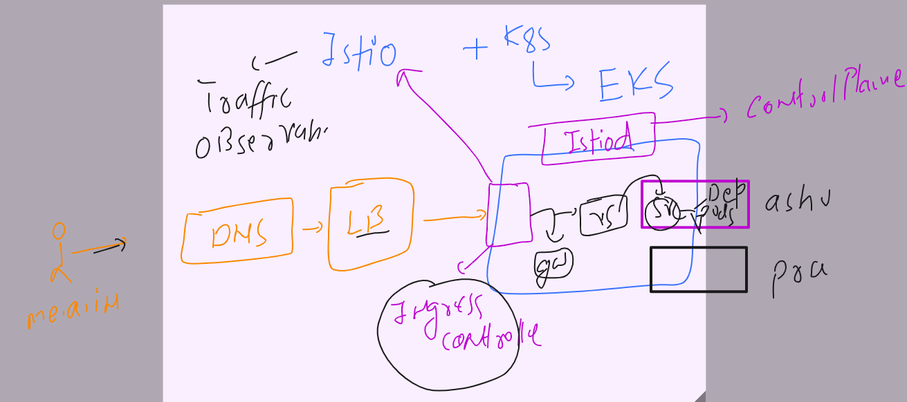
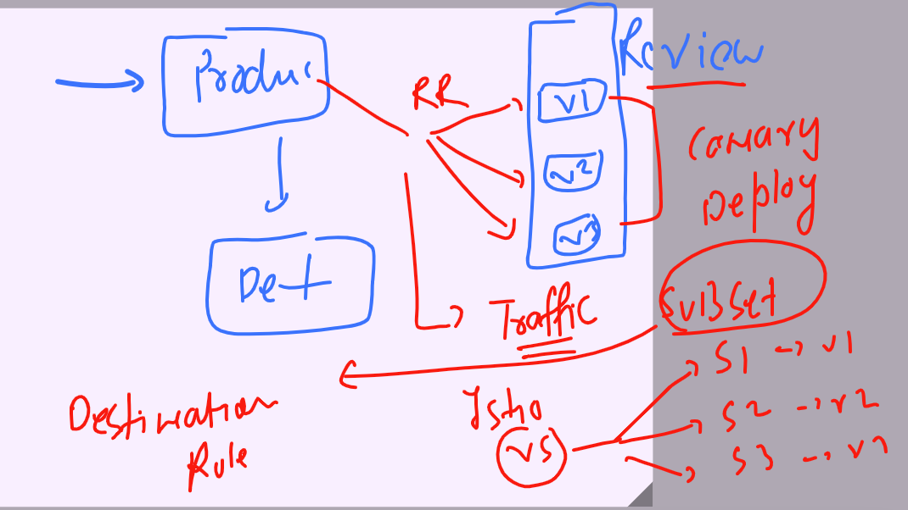
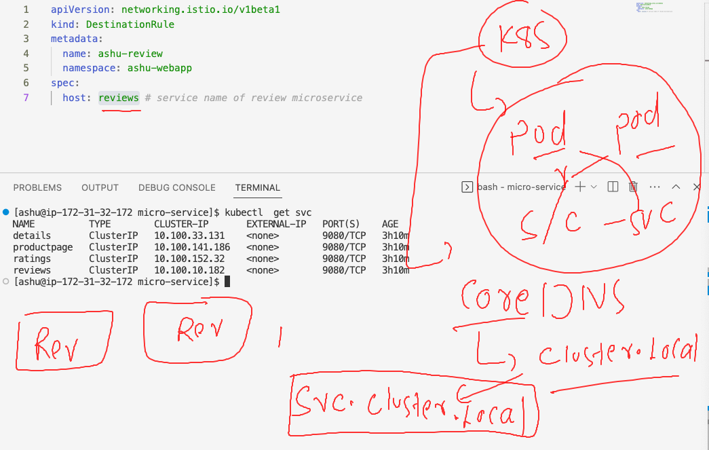
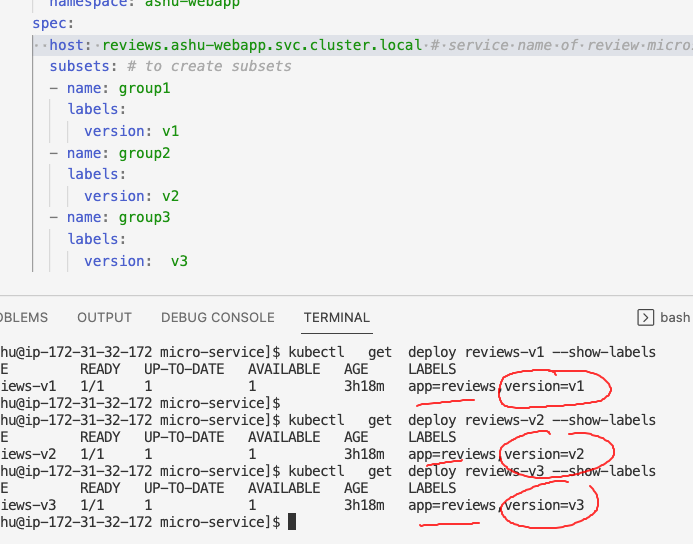
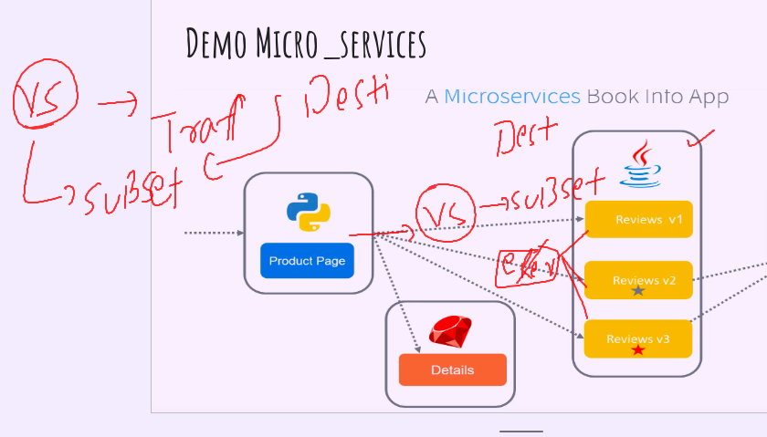

### Revision 



### traffic distribution using Istio -- subset concept 



### Observability in Istio 


### accessing observability tools using istioctl 

```
ashu@ip-172-31-32-172 ~]$ istioctl  dashboard -h
Access to Istio web UIs

Usage:
  istioctl dashboard [flags]
  istioctl dashboard [command]

Aliases:
  dashboard, dash, d

Available Commands:
  controlz    Open ControlZ web UI
  envoy       Open Envoy admin web UI
  grafana     Open Grafana web UI
  jaeger      Open Jaeger web UI
  kiali       Open Kiali web UI
  prometheus  Open Prometheus web UI
  skywalking  Open SkyWalking UI
  zipkin      Open Zipkin web UI

Flags:
      --address string   Address to listen on. Only accepts IP address or localhost as a value. When localhost is supplied, istioctl will try to bind on both 127.0.0.1 and ::1 and will fail if neither of these address are available to bind. (default "localhost")
      --browser          When --browser is supplied as false, istioctl dashboard will not open the browser. Default is true which means istioctl dashboard will always open a browser to view the dashboard. (default true)
  -h, --help             help for dashboard
  -p, --port int         Local port to listen to

Global Flags:
      --context string      The name of the kubeconfig context to use
  -c, --kubeconfig string   Kubernetes configuration file
      --vklog Level         number for the log level verbosity. Like -v flag. ex: --vklog=9

Use "istioctl dashboard [command] --help" for more information about a command.
[ashu@ip-172-31-32-172 ~]$ istioctl  dashboard kiali 
http://localhost:20001/kiali
Failed to open browser; open http://localhost:20001/kiali in your browser.
^C[ashu@ip-172-31-32-172 ~]$ 

```

### in prod env we can access kiali / prometheus /like normal k8s app

```
ashu@ip-172-31-32-172 ~]$ kubectl   get svc -n istio-system 
NAME                   TYPE           CLUSTER-IP       EXTERNAL-IP                                                               PORT(S)                                      AGE
grafana                ClusterIP      10.100.202.87    <none>                                                                    3000/TCP                                     147m
istio-ingressgateway   LoadBalancer   10.100.74.95     ad78f794e663048b9a70309c02ef9402-562921084.ap-south-1.elb.amazonaws.com   15021:30596/TCP,80:32038/TCP,443:30790/TCP   176m
istiod                 ClusterIP      10.100.185.107   <none>                                                                    15010/TCP,15012/TCP,443/TCP,15014/TCP        177m
jaeger-collector       ClusterIP      10.100.185.11    <none>                                                                    14268/TCP,14250/TCP,9411/TCP                 147m
kiali                  ClusterIP      10.100.252.162   <none>                                                                    20001/TCP,9090/TCP                           147m
prometheus             ClusterIP      10.100.225.239   <none>                                                                    9090/TCP                                     147m
tracing                ClusterIP      10.100.209.226   <none>                                                                    80/TCP,16685/TCP                             147m
zipkin                 ClusterIP      10.100.50.216    <none>                                                                    9411/TCP                                     147m
[ashu@ip-172-31-32-172 ~]$ 
[ashu@ip-172-31-32-172 ~]$ kubectl   -n istio-system  get deploy kiali 
NAME    READY   UP-TO-DATE   AVAILABLE   AGE
kiali   1/1     1            1           148m
[ashu@ip-172-31-32-172 ~]$ kubectl   -n istio-system  get po kiali-7d7df7458c-g8hfp 
NAME                     READY   STATUS    RESTARTS   AGE
kiali-7d7df7458c-g8hfp   1/1     Running   0          148m
[ashu@ip-172-31-32-172 ~]$ kubectl   -n istio-system  get svc kiali 
NAME    TYPE        CLUSTER-IP       EXTERNAL-IP   PORT(S)              AGE
kiali   ClusterIP   10.100.252.162   <none>        20001/TCP,9090/TCP   148m
[ashu@ip-172-31-32-172 ~]$ 
[ashu@ip-172-31-32-172 ~]$ kubectl   -n istio-system  get gw
NAME            AGE
kiali-gateway   149m
[ashu@ip-172-31-32-172 ~]$ kubectl   -n istio-system  get vs
NAME                    GATEWAYS            HOSTS                    AGE
kiali-vs-routing-rule   ["kiali-gateway"]   ["kiali.ashutoshh.in"]   149m
[ashu@ip-172-31-32-172 ~]$ 


```

### COREDNS in k8s 



### creating subset using destination rules 



### YAML of Destination rule 

```
apiVersion: networking.istio.io/v1beta1
kind: DestinationRule
metadata:
  name: ashu-review
  namespace: ashu-webapp
spec:
  host: reviews.ashu-webapp.svc.cluster.local # service name of review microservice 
  subsets: # to create subsets 
  - name: group1
    labels:
      version: v1
  - name: group2
    labels:
      version: v2
  - name: group3 
    labels:
      version:  v3 
```


### deploy it 

```
[ashu@ip-172-31-32-172 micro-service]$ kubectl apply -f  destionation_rule_review.yaml 
destinationrule.networking.istio.io/ashu-review created
[ashu@ip-172-31-32-172 micro-service]$ kubectl  get  dst
error: the server doesn't have a resource type "dst"
[ashu@ip-172-31-32-172 micro-service]$ kubectl  get  destinationrules
NAME          HOST                                    AGE
ashu-review   reviews.ashu-webapp.svc.cluster.local   13s
```

### How traffic spliting will be done in Istio -- using Virtual service 



### deploy it 

### YAML

```
apiVersion: networking.istio.io/v1beta1
kind: VirtualService
metadata:
  name: ashu-review-traffic-split
  namespace: ashu-webapp
spec:
  hosts:
  - reviews.ashu-webapp.svc.cluster.local
  http:
  - route: 
    - destination:
        subset: group1
        host: reviews  # many time we are having different service name also under same label
      weight: 70
    - destination:
        subset: group2 
        host: reviews
      weight: 20
    - destination:
        subset: group3 
        host: reviews
      weight: 10 
```

### deploy it 

```
[ashu@ip-172-31-32-172 micro-service]$ kubectl  apply -f vs_for_traffic_split.yaml 
virtualservice.networking.istio.io/ashu-review-traffic-split created
[ashu@ip-172-31-32-172 micro-service]$ kubectl  get  vs
NAME                        GATEWAYS                HOSTS                                       AGE
ashu-review-traffic-split                           ["reviews.ashu-webapp.svc.cluster.local"]   4s
ashu-vs-routing-rule        ["ashu-micro-app-gw"]   ["me.ashutoshh.in"]                         3h38m
[ashu@ip-172-31-32-172 micro-service]$ 


```


