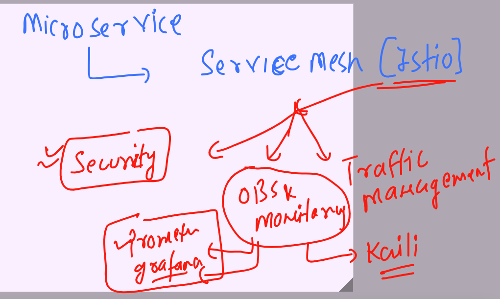
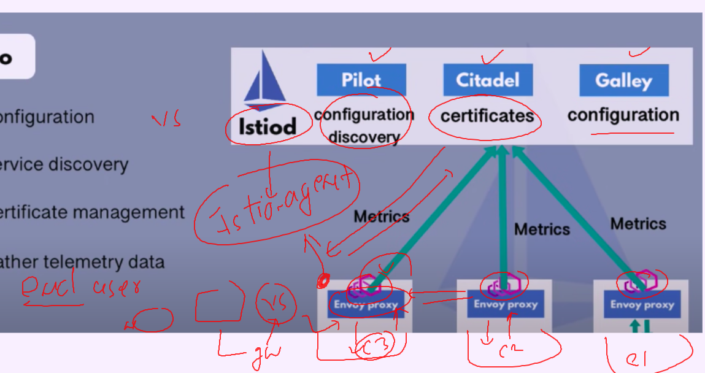

## Revision 

### Istio servicemesh offerings 



### Istio architecture 




### redeploying k8s app after labeling 

```
[ashu@ip-172-31-32-172 ~]$ kubectl  label namespaces ashu-webapp istio-injection=enabled 
namespace/ashu-webapp labeled
[ashu@ip-172-31-32-172 ~]$ kubectl  delete all,gw,vs,dr  --all 

```

### tip for envoy proxy injection in particular deployment yaml 

```
[ashu@ip-172-31-32-172 micro-service]$ kubectl  apply -f  <(istioctl  kube-inject -f bookinfo.yaml)    -n default 
service/details created
serviceaccount/bookinfo-details created
deployment.apps/details-v1 created
service/ratings created
serviceaccount/bookinfo-ratings created
deployment.apps/ratings-v1 created
service/reviews created
serviceaccount/bookinfo-reviews created
deployment.apps/reviews-v1 created
deployment.apps/reviews-v2 created
deployment.apps/reviews-v3 created
service/productpage created
serviceaccount/bookinfo-productpage created
deployment.apps/productpage-v1 created
[ashu@ip-172-31-32-172 micro-service]$ kubectl  get  po -n default 
NAME                            READY   STATUS            RESTARTS   AGE
details-v1-544f4588f4-6vqjm     2/2     Running           0          4s
productpage-v1-87575b9c-g6nwk   0/2     Init:0/1          0          4s
ratings-v1-6fcbdc9db6-b5bfw     2/2     Running           0          4s
reviews-v1-5677675b45-pzww9     0/2     PodInitializing   0          4s
reviews-v2-55b8cd7fbd-tvvvz     2/2     Running           0          4s
reviews-v3-789c58575-2l9g5      2/2     Running           0          4s
[ashu@ip-172-31-32-172 micro-service]$ kubectl  create deployment d1 --image=nginx --port 80  -n default 
deployment.apps/d1 created
[ashu@ip-172-31-32-172 micro-service]$ kubectl  get po
No resources found in ashu-webapp namespace.
[ashu@ip-172-31-32-172 micro-service]$ kubectl  get po -n default 
NAME                            READY   STATUS              RESTARTS   AGE
d1-6cb868647c-vk9jt             0/1     ContainerCreating   0          8s
details-v1-544f4588f4-6vqjm     2/2     Running             0          89s
productpage-v1-87575b9c-g6nwk   2/2     Running             0          89s
```

### fault injection and retry logic 

```
apiVersion: networking.istio.io/v1beta1
kind: VirtualService
metadata:
  name: ashu-details-vs
  namespace: ashu-webapp
spec:
  hosts:
  - details.ashu-webapp.svc.cluster.local
  http:
  - route: 
    - destination:
        host: details.ashu-webapp.svc.cluster.local
    fault: # fault injection it offer two kind 
      abort:
        percentage:
          value: 0.2
        httpStatus: 400 
      delay: 
        percentage:
          value: 0.3
        fixedDelay: 7s 
    retries:
      attempts: 3
      perTryTimeout: 2s 
  
```

