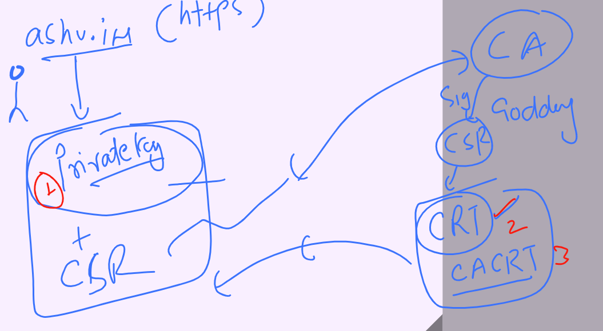
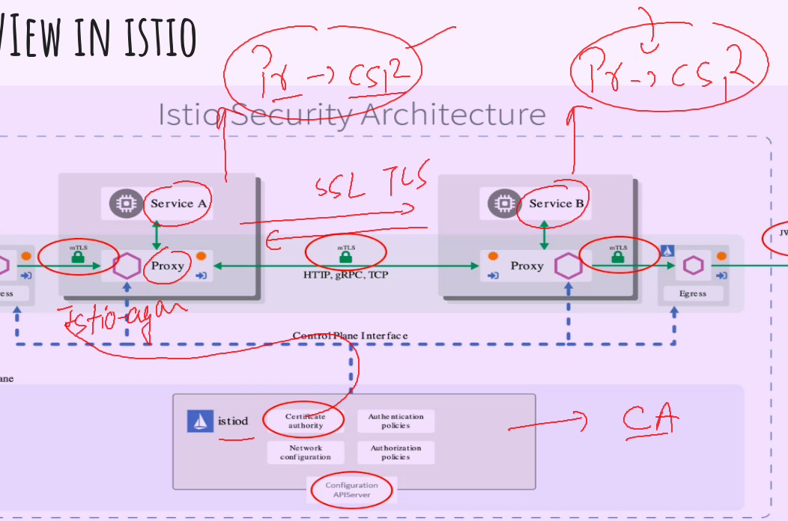
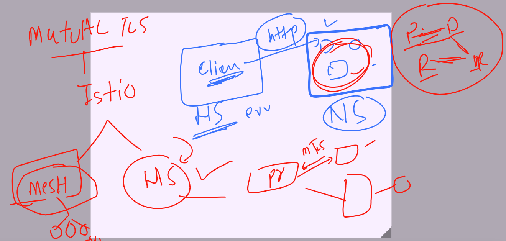
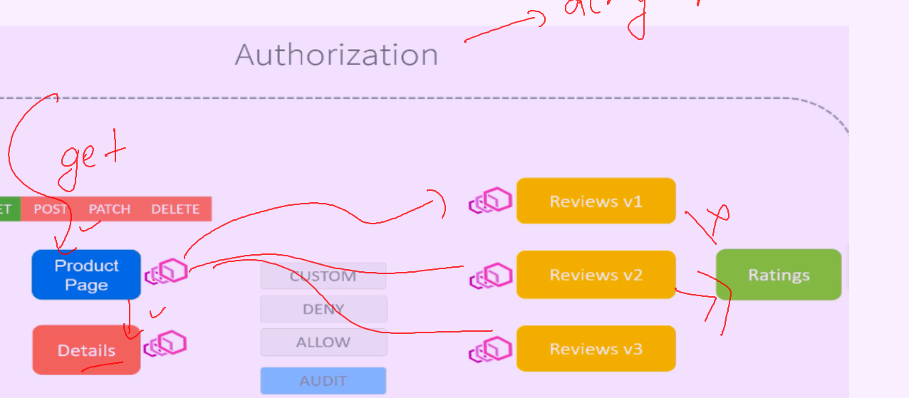

## Revision 

### Istio servicemesh offerings 


### Istio architecture 


### redeploying k8s app after labeling 

```
[ashu@ip-172-31-32-172 ~]$ kubectl  label namespaces ashu-webapp istio-injection=enabled 
namespace/ashu-webapp labeled
[ashu@ip-172-31-32-172 ~]$ kubectl  delete all,gw,vs,dr  --all 

```

### tip for envoy proxy injection in particular deployment yaml 

```
[ashu@ip-172-31-32-172 micro-service]$ kubectl  apply -f  <(istioctl  kube-inject -f bookinfo.yaml)    -n default 
service/details created
serviceaccount/bookinfo-details created
deployment.apps/details-v1 created
service/ratings created
serviceaccount/bookinfo-ratings created
deployment.apps/ratings-v1 created
service/reviews created
serviceaccount/bookinfo-reviews created
deployment.apps/reviews-v1 created
deployment.apps/reviews-v2 created
deployment.apps/reviews-v3 created
service/productpage created
serviceaccount/bookinfo-productpage created
deployment.apps/productpage-v1 created
[ashu@ip-172-31-32-172 micro-service]$ kubectl  get  po -n default 
NAME                            READY   STATUS            RESTARTS   AGE
details-v1-544f4588f4-6vqjm     2/2     Running           0          4s
productpage-v1-87575b9c-g6nwk   0/2     Init:0/1          0          4s
ratings-v1-6fcbdc9db6-b5bfw     2/2     Running           0          4s
reviews-v1-5677675b45-pzww9     0/2     PodInitializing   0          4s
reviews-v2-55b8cd7fbd-tvvvz     2/2     Running           0          4s
reviews-v3-789c58575-2l9g5      2/2     Running           0          4s
[ashu@ip-172-31-32-172 micro-service]$ kubectl  create deployment d1 --image=nginx --port 80  -n default 
deployment.apps/d1 created
[ashu@ip-172-31-32-172 micro-service]$ kubectl  get po
No resources found in ashu-webapp namespace.
[ashu@ip-172-31-32-172 micro-service]$ kubectl  get po -n default 
NAME                            READY   STATUS              RESTARTS   AGE
d1-6cb868647c-vk9jt             0/1     ContainerCreating   0          8s
details-v1-544f4588f4-6vqjm     2/2     Running             0          89s
productpage-v1-87575b9c-g6nwk   2/2     Running             0          89s
```

### fault injection and retry logic 

```
apiVersion: networking.istio.io/v1beta1
kind: VirtualService
metadata:
  name: ashu-details-vs
  namespace: ashu-webapp
spec:
  hosts:
  - details.ashu-webapp.svc.cluster.local
  http:
  - route: 
    - destination:
        host: details.ashu-webapp.svc.cluster.local
    fault: # fault injection it offer two kind 
      abort:
        percentage:
          value: 0.2
        httpStatus: 400 
      delay: 
        percentage:
          value: 0.3
        fixedDelay: 7s 
    retries:
      attempts: 3
      perTryTimeout: 2s 
  
```

### SSL understanding 



### CA as Istiod and istio-agent 



### testing app communication without mutual TLS -- outside namespace 

```
[ashu@ip-172-31-32-172 ashu-application]$ kubectl  create  ns  ashu-app-access 
namespace/ashu-app-access created
[ashu@ip-172-31-32-172 ashu-application]$ 
[ashu@ip-172-31-32-172 ashu-application]$ 
[ashu@ip-172-31-32-172 ashu-application]$ kubectl  apply -f <(istioctl kube-inject -f /tmp/httpbin.yaml) -n  ashu-app-access  serviceaccount/httpbin created
service/httpbin created
deployment.apps/httpbin created
[ashu@ip-172-31-32-172 ashu-application]$ kubectl  get po -n ashu-app-access 
NAME                       READY   STATUS            RESTARTS   AGE
httpbin-65895fd745-cc8fx   0/2     PodInitializing   0          12s
[ashu@ip-172-31-32-172 ashu-application]$ 

```

### From other namespace i am access productpage via envoy proxy container 

```
[ashu@ip-172-31-32-172 ashu-application]$ kubectl  get po -n ashu-app-access 
NAME                       READY   STATUS    RESTARTS   AGE
httpbin-65895fd745-cc8fx   2/2     Running   0          5m15s
[ashu@ip-172-31-32-172 ashu-application]$ 
[ashu@ip-172-31-32-172 ashu-application]$ 
[ashu@ip-172-31-32-172 ashu-application]$ kubectl  -n  ashu-app-access  exec -it  httpbin-65895fd745-cc8fx  -c istio-proxy  -- bash 
istio-proxy@httpbin-65895fd745-cc8fx:/$ 
istio-proxy@httpbin-65895fd745-cc8fx:/$ 
istio-proxy@httpbin-65895fd745-cc8fx:/$ curl http://productpage.ashu-webapp.svc.cluster.local:9080  
<!DOCTYPE html>
<html>
  <head>
```

### Implementing mutual tls in istio 



### creating for particular micro service 

```
apiVersion: security.istio.io/v1beta1
kind: PeerAuthentication
metadata:
  name: ashu-mtls1
  namespace: ashu-webapp
spec:
  selector:
    matchLabels:
      app: details
      version: v11
  mtls:
    mode: STRICT 
    
```

### or to implement in Entire namespace 

```
apiVersion: security.istio.io/v1beta1
kind: PeerAuthentication
metadata:
  name: ashu-mtls1
  namespace: ashu-webapp
spec:
  mtls:
    mode: STRICT 
```

### lets do that 

```
[ashu@ip-172-31-32-172 ashu-application]$ kubectl  apply -f micro-service/ashu-mtls.yaml 
peerauthentication.security.istio.io/ashu-mtls1 created
[ashu@ip-172-31-32-172 ashu-application]$ 
[ashu@ip-172-31-32-172 ashu-application]$ kubectl  get peerauthentication
NAME         MODE     AGE
ashu-mtls1   STRICT   18s
[ashu@ip-172-31-32-172 ashu-application]$ kubectl  get pa
NAME         MODE     AGE
ashu-mtls1   STRICT   22s
[ashu@ip-172-31-32-172 ashu-application]$ 

```

## Note; istio related kubernetes CRD list 

```
ashu@ip-172-31-32-172 ~]$ kubectl  api-resources   |  grep -i istio
wasmplugins                                    extensions.istio.io/v1alpha1           true         WasmPlugin
istiooperators                    iop,io       install.istio.io/v1alpha1              true         IstioOperator
destinationrules                  dr           networking.istio.io/v1beta1            true         DestinationRule
envoyfilters                                   networking.istio.io/v1alpha3           true         EnvoyFilter
gateways                          gw           networking.istio.io/v1beta1            true         Gateway
proxyconfigs                                   networking.istio.io/v1beta1            true         ProxyConfig
serviceentries                    se           networking.istio.io/v1beta1            true         ServiceEntry
sidecars                                       networking.istio.io/v1beta1            true         Sidecar
virtualservices                   vs           networking.istio.io/v1beta1            true         VirtualService
workloadentries                   we           networking.istio.io/v1beta1            true         WorkloadEntry
workloadgroups                    wg           networking.istio.io/v1beta1            true         WorkloadGroup
authorizationpolicies                          security.istio.io/v1                   true         AuthorizationPolicy
peerauthentications               pa           security.istio.io/v1beta1              true         PeerAuthentication
requestauthentications            ra           security.istio.io/v1                   true         RequestAuthentication
telemetries                       telemetry    telemetry.istio.io/v1alpha1            true         Telemetry
[ashu@ip-172-31-32-172 ~]$ 


```

### ok lets check from diff ns to access the same 

```
ashu@ip-172-31-32-172 ashu-application]$ kubectl  -n  ashu-app-access  exec -it  httpbin-65895fd745-cc8fx  -c istio-proxy  -- bash 
istio-proxy@httpbin-65895fd745-cc8fx:/$ 
istio-proxy@httpbin-65895fd745-cc8fx:/$ 
istio-proxy@httpbin-65895fd745-cc8fx:/$ curl http://productpage.ashu-webapp.svc.cluster.local:9080
curl: (56) Recv failure: Connection reset by peer
istio-proxy@httpbin-65895fd745-cc8fx:/$ 
istio-proxy@httpbin-65895fd745-cc8fx:/$ 
istio-proxy@httpbin-65895fd745-cc8fx:/$ curl http://productpage.ashu-webapp.svc.cluster.local:9080
curl: (56) Recv failure: Connection reset by peer
istio-proxy@httpbin-65895fd745-cc8fx:/$ curl http://productpage.ashu-webapp.svc.cluster.local:9080
curl: (56) Recv failure: Connection reset by peer
istio-proxy@httpbin-65895fd745-cc8fx:/$ curl http://productpage.ashu-webapp.svc.cluster.local:9080
curl: (56) Recv failure: Connection reset by peer
istio-proxy@httpbin-65895fd745-cc8fx:/$ curl http://productpage.ashu-webapp.svc.cluster.local:9080
curl: (56) Recv failure: Connection reset by peer
istio-proxy@httpbin-65895fd745-cc8fx:/$ curl http://productpage.ashu-webapp.svc.cluster.local:9080
curl: (56) Recv failure: Connection reset by peer
istio-proxy@httpbin-65895fd745-cc8fx:/$ 
```

### Implement Entire mesh as mtls 

```
apiVersion: security.istio.io/v1beta1
kind: PeerAuthentication
metadata:
  name: ashu-mtls1
  namespace: istio-system # entire mesh as mtls 
spec:
  mtls:
    mode: STRICT 
```

### authorization in Istio 



==== # Deny all policy 

```
apiVersion: security.istio.io/v1
kind: AuthorizationPolicy
metadata:
  name: ashu-deny-all
  namespace: ashu-webapp
spec: # selecting all 
  {}
```

### deploy it 

```
[ashu@ip-172-31-32-172 ashu-application]$ kubectl  apply -f micro-service/ashu-app_block_all.yaml 
authorizationpolicy.security.istio.io/ashu-deny-all created
[ashu@ip-172-31-32-172 ashu-application]$ kubectl  get AuthorizationPolicy
NAME            AGE
ashu-deny-all   12s
```


